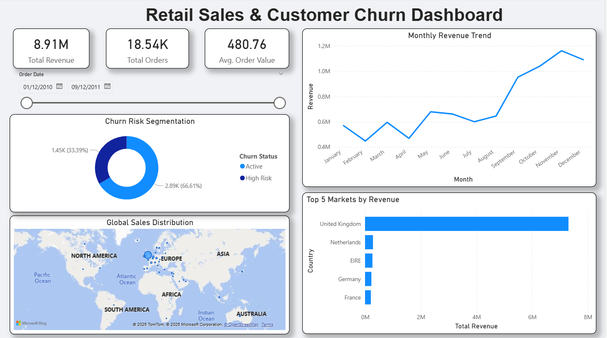

# Retail Sales & Customer Churn Analysis

## Project Overview
This end-to-end Business Intelligence pipeline identifies $8.9M in total revenue and segments high-risk churn customers. The system processes raw retail transaction data to calculate Customer Lifetime Value (CLV) and flag churn risks based on purchasing behavior.

## Project Documentation
* **[Business Problem & Objective](problem_statement.md):** Detailed breakdown of the client's challenges and project goals.
* **[Analysis & Results](analysis_results.md):** In-depth report on the 66% churn rate, market performance, and strategic recommendations.

## Dashboard

## Tech Stack
* **Python:** Data cleaning and ETL pipeline (Pandas).
* **SQL (PostgreSQL):** Logic for "High Risk" segmentation (defined as 90-day inactivity).
* **Power BI:** Visualization of Churn vs. Active customer segments and revenue trends.

## Key Insights
* **High Churn Rate:** 66% of customers are identified as "High Risk," indicating a large volume of one-time purchasers who have not returned in 90 days.
* **Dominant Market:** The UK accounts for the vast majority of revenue, suggesting the business is heavily domestic-focused despite international presence in Netherlands and EIRE.
* **Q4 Seasonality:** Revenue spikes significantly in Q4 (Nov-Dec), confirming strong holiday season dependency.